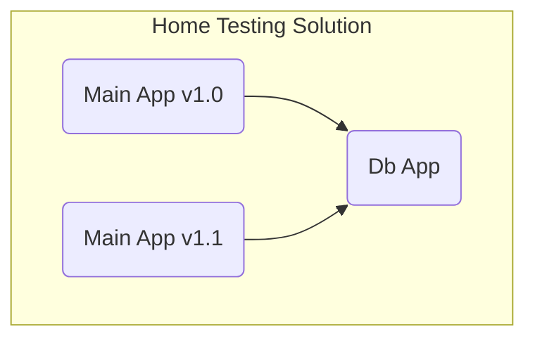

# NHS Home Testing Service

[](https://github.com/NHSDigital/nhs-home-testing-service/actions/workflows/deploy-main.yml)

This repository contains code for the NHS Home Testing Service project.

## Table of Contents

- [NHS Home Testing Service](#nhs-home-testing-service)
  - [Table of Contents](#table-of-contents)
  - [Project structure](#project-structure)
    - [CDK Apps](#cdk-apps)
      - [Db CDK App](#db-cdk-app)
      - [Main CDK App](#main-cdk-app)
      - [Dev CDK App](#dev-cdk-app)
      - [Shared CDK App](#shared-cdk-app)
    - [Directory structure](#directory-structure)
  - [Initial Project Setup](#initial-project-setup)
    - [Install required tools](#install-required-tools)
    - [Commit signing](#commit-signing)
    - [Branch naming](#branch-naming)
  - [Build](#build)
  - [Deploy](#deploy)
    - [Prerequisites](#prerequisites)
      - [Configure access to AWS](#configure-access-to-aws)
      - [Verify AWS access](#verify-aws-access)
    - [Pre-deployment configuration (one time)](#pre-deployment-configuration-one-time)
    - [Deploy commands](#deploy-commands)
      - [Whole solution deployment (all stacks)](#whole-solution-deployment-all-stacks)
      - [Single CDK app deployment](#single-cdk-app-deployment)
      - [Single CDK stack deployment](#single-cdk-stack-deployment)
    - [KMS policy update](#kms-policy-update)
    - [Post deployment commands](#post-deployment-commands)
      - [Post deployment environment checks](#post-deployment-environment-checks)
    - [Running the app locally](#running-the-app-locally)
    - [Unit Tests](#unit-tests)
    - [Postman env generation](#postman-env-generation)
    - [CloudWatch saved queries generation](#cloudwatch-saved-queries-generation)
    - [Data load to DynamoDb tables](#data-load-to-dynamodb-tables)
    - [Environment removal](#environment-removal)
    - [WAF Deployment](#waf-deployment)
    - [Add IP Address for Allow-List](#add-ip-address-for-allow-list)
    - [Shared stacks deployment](#shared-stacks-deployment)

## Project structure

### CDK Apps

The project contains 2 CDK apps: one that contains DB-related resources (db app) and another one that contains the remaining resources (main app). This separation was done in preparation for blue/green deployment so that multiple versions of the solution can target the same DB instance:



#### Db CDK App

- `nht-db-stack` - stack that contains the data storage (DynamoDb tables)
- `nht-data-load-stack` - stack that allows to load static data to DynamoDb reference tables (e.g. supported gp ods codes)

#### Main CDK App

- `nht-db-import-stack` - stack that imports DynamoDb tables from the DB app
- `nht-backend-stack` - stack that contains backend lambdas for the frontend application
- `nht-ui-stack` - stack that covers the cloudfront distribution and the S3 site deployment bucket as well as job to copy the site content to the bucket
- `nht-order-stack` - stack that covers the API gateway as well as lambdas / SQS queues for order placement
- `nht-result-stack` - stack that contains the resources covering the test results processing flow (Lambdas, Queues, Api Gateway)
- `nht-event-stack` - stack that contain the resources related to logging of events

#### Dev CDK App

- `nht-mocks-stack` - stack with an API gateway with mocked endpoints for third party APIs

#### Shared CDK App

These are components, resources and configurations that are shared across all environments within a singular AWS account, these are resources that are cheaper and easier to manage by having one shared instance per AWS Account instead of one instance per environment.

These are either deployed via dedicated scripts in the "shared" folder, or as part of deploy.yml to ensure that these resources exist on the account.

Note that changes to resources here will impact all enviornments within the AWS Account

- `global-waf-stack` - Stack that deploys a US-EAST-1 (global) WAF for CloudFront Distributions
- `regional-waf-stack` - Stack that deploys an EU-WEST-2 WAF for API Gateways, additionally exports the global-waf-stack ARN to the EU-WEST-2 CloudFormation region to allow assocations between the UI stack and the CloudFront WAF

### Directory structure

- `lambdas` - this directory contains node.js code for all lambdas. The names of the subfolders should correspond to lambda resource names and each lambda should implement a `main` handler function in the `index.js` file
- `infra` - this directory contains infrastructure as code part written in CDK
- `data` - this directory contains data to be loaded to DynamoDb reference tables (e.g. supported gp ods codes)
- `scripts` - the directory that contains scripts some of which are coming from the NHS repository template to support required checks. For more info go [here](./scripts/README.md)
- `integration-utils` - directory with additional tools e.g. Postman collections and env files
- `ui` - directory with the questionnaire frontend application

## Initial Project Setup

### Install required tools

- Node.js

  - Install NVM to manage Node versions: <https://github.com/nvm-sh/nvm?tab=readme-ov-file#installing-and-updating>
  - Then use it to install node version 24

  ```shell
  $ nvm install 24
  $ nvm use 24
  ```

- CDK

  ```bash
  $ npm install -g aws-cdk
  ```

- Gitleaks

  ```bash
  $ brew install gitleaks
  ```

- VS Code IDE

  <https://code.visualstudio.com/>

  You will find the recommended extensions configured in the vscode extensions file
  `.vscode/extensions.json`. They should appear in the recommended list of extensions in the extensions tab as well.

- Postman

  <https://www.postman.com/downloads/>

- AWS CLI

- JQ command

  <https://jqlang.github.io/jq/download/>

### Commit signing

NHS Digital recommend that we setup commit signing with GPG keys. GitHub has a good guide here:

<https://docs.github.com/en/authentication/managing-commit-signature-verification>

The gpg command line utility can be installed using command: `brew install gnupg`

### Branch naming

When working on the project, please refer to using valid branch naming schemes:

Examples of valid branch names:

- bug/nhts-111/refresh-issue-fix
- feature/nhts/222-event-validation
- epic/nhts-333/content-changes

Branch types:

- feature - used for any feature branches related to Jira tickets of type Story
- bug - used for any feature branches related to Jira tickets of type Bug
- epic - used for epic-level branches

More information provided here:

<https://nhsd-confluence.digital.nhs.uk/display/NHT/Git+Practices>

## Build

To build the solution you need to run the `npm run install-all` command in the root folder

## Deploy

### Prerequisites

#### Configure access to AWS

Option 1 - create/edit a profile in ~/.aws/config

```bash
[default]
sso_start_url=https://d-9c67018f89.awsapps.com/start#
sso_region=eu-west-2
sso_account_id=880521146064
sso_role_name=NonProd-Admins
region=eu-west-2
output=json
```

Option 2 - configure using the AWS CLI

Run AWS CLI command `aws configure sso`.

#### Verify AWS access

Once that's done you will be able to login in the console using `aws sso login --profile <profileName>` (you can omit the profile parameter when using the default profile).

Ensure you have access to AWS by running a sample command (eg. `aws s3 ls` what should list the buckets in the account).

### Pre-deployment configuration (one time)

1. **Run the pre-deployment script**

   ```bash
   $ npm run pre-deploy <envName>
   ```

   The script does the following:

   - deploys the mock stack (the mock api URL needs to be injected to other stacks)
   - deploys the monitoring stack (RUM app monitor needs to be injected to ui stack, and collectDlqMessages lambda also has to be injected to other stacks)
   - generates environment files based on templates for the two CDK apps

2. **Create the required AWS Secret Manager secrets (Optional)**
   1. Endeavour Predict API key\
      _This key is required if you plan to use the Endeavour Predict API endpoint instead of using mocks._
   - Sign up to the Endeavour Predict API, url: <https://dev.endeavourpredict.org/>
   - Subscribe to the API:
     - Go to Catalog section and select Development category. You should see Endeavour Predict API (Dev), click 'VIEW API'
     - Click 'SUBSCRIBE' button in the right top corner, select Development Plan and assign it to the Default Application, then continue and click 'VALIDATE THE REQUEST'
   - Get the API key by going to Applications > Default Application > Subscriptions. Copy the key from API Keys section on the right
   - Create secret in AWS Secret Manager
     - Go to AWS Secret Manager -> Store a new secret -> Other type of secret -> Plaintext
     - Replace template with subscription key retrieved from Endeavour Predict API page
     - Click Next and specify the secret name = `nhc/<envName>/qcalc-api-key`
     - Click Next again x2 (use the default, no need to specify rotation)
     - Click Store to finish creating of the secret
   - Update the `RISK_API_BASE_URL` variable in your env's config file with the Endeavour Predict API url: <https://api.endeavourpredict.org/dev/epredict>
   - Add `RISK_API_KEY_SECRET_NAME` variable to your env's config file:
     `RISK_API_KEY_SECRET_NAME="nhc/<envName>/qcalc-api-key"`

### Deploy commands

#### Whole solution deployment (all stacks)

Run the full environment deployment script - this will build the UI and deploy CDK apps (Dev, Db, Main)

```bash
$ npm run deploy <envName>
```

For local deployment please use the below command instead. This will apply local overrides to environment variables before deployment.

```bash
$ npm run deploy-local <envName>
```

If you make a code change you might want to deploy just a single app or stack as it runs quicker

#### Single CDK app deployment

Deployment of a CDK app with all stacks to configured AWS Account with the following command replacing the environment context value with your environment name

```bash
$ cdk deploy --all --context environment=demo --context awsAccount=poc #use default profile
$ cdk deploy --all --context environment=demo --context awsAccount=poc --profile dev #use named profile
```

After the deployment you will see the API's URL, which represents the url you can then use.

#### Single CDK stack deployment

Usually there is no need to deploy all the stacks but just the ones that change. To list all the available stacks use:

```bash
$ cdk ls
```

To deploy a single stack use:

```bash
$ cdk deploy <stack name> --context environment=demo
$ cdk deploy demo-nht-db-stack --context environment=demo
```

### KMS policy update

Contact the platform team to add your environment's IAM roles to the list of allowed resources for KMS Key decryption. You only need to provide them your environment's name.

### Post deployment commands

Once the deployment has completed successfully run the following command:

```bash
$ npm run post-deploy <envName> <accountName> # accountName is optional, it defaults to poc
```

This will create a postman environment file for your stage, apply database migrations (some initial data) and deploy saved queries to CloudWatch

#### Post deployment environment checks

- Open AWS console and check if all resources are created, the DB tables are created and populated with test data in particular
- At this point you should be able to navigate to _https://\<envName\>.nhttest.org/_ and see the login page for the app
- Import postman collection and the environment file generated for your env. You can find them in `integration-utils/postman/NHS Home Testing` folder

### Running the app locally

When running the frontend app locally, it will still use the AWS lambdas from API Gateway in AWS. To allow the auth cookie to be written locally after login, you must add a third party cookie exception:

> Open Chrome > Settings > Privacy and security > Third-party cookies > Sites allowed to use third-party cookies > Enter "localhost:3000"

> Open Firefox > Settings> Privacy & Security > Enhanced Tracking Protection > Managed Exceptions > add localhost:3000

In order to run the questionnaire app locally make sure to deploy the solution with the _deploy-local_ option.

```bash
$ npm run deploy-local <envName>
```

This will ensure the NHS Login redirect url is pointing at localhost instead of your cloud environment as well as allow the backend calls (CORS limitations).

Then run the web app locally with the following npm command:

```bash
$ npm run run-local <envName>
```

You can access the app locally using the url: <https://localhost:3000/>.

The frontend application still targets your backend api lambdas as well as Dynamodb tables.

### Unit Tests

Jest is setup in the lambdas and ui subprojects. You can run the tests with the following command:

```bash
$ npm run test
```

### Postman env generation

When there is a significant change in the solution that require the postman env file to be regenerated (e.g. a new config, change of config due to stack re-creation) you can run the following command:

```bash
$ npm run generate-postman <envName>
```

### CloudWatch saved queries generation

To deploy saved queries run the following command:

```bash
$ npm run generate-queries <envName>
```

For more info go [here](./scripts/README.md#saved-insights-queries)

### Data load to DynamoDb tables

The data load functionality allows to load predefined data to reference tables. The data for this action is stored in `data/db` folder. This folder is supposed to contain subfolders matching the table names (without the env name bit which is resolved at lambda runtime). The files in those folders are used as input to DynamoDB batch write items operation. This operation has a limit of 25 put or delete operations / 16MB so a single file should contain up to 25 inserts or deletes. If there are more require please use separate files to configure them.

```json
{
  "inserts": [
    {
      "gpOdsCode": "test1",
      "enabled": true
    },
    {
      "gpOdsCode": "test2",
      "enabled": false
    }
  ]
}
```

The data load requires two steps:

1. First the data load stack needs to be deployed to AWS. This will ensure the data load lambda and S3 bucket is in place as well as the bucket contains the data from `data/db` folder in this solution.

2. Secondly the lambda needs to be invoked. This can be done via AWS console in the browser or using the following command where `envName` needs to be substituted by the name of the env e.g. demo

```bash
$ npm run load-data <envName>
```

This will trigger the lambda and the data will be uploaded to DynamoDB tables.

### Environment removal

To remove an environment, use the destroy-env.sh script, by running the following npm command and passing the environment name and aws account name as a param:

```bash
$  npm run destroy-env <envName> <awsAccount>
```

The script uses `cdk destroy` command to remove the CloudFormation stacks and then removes leftover CloudWatch log groups and schedules deletion (after 7 days) of `nht/ENV_NAME/test-api-key` secrets in Secrets Manager.

### WAF Deployment

To create, or update the deployed WAF ACLs, run the following command

```bash
$ npm run deploy-security
```

This will update the shared security stacks that:

- Create three WAF Web ACLs:
  - Global WAF deployed in us-east-1 to protect CloudFront distributions.
  - Regional WAF deployed in eu-west-2 to protect API Gateways.
  - Integrator WAF deployed in eu-west-2 to protect Results API Gateway.

### Add IP Address for Allow-List

If an IP address is required to be added, add the IP address to infra/security/ip-allow-list.ts and run the above WAF deployment script to update the deployed ACLs

### Shared stacks deployment

Shared stacks contain resources that meant to created only once per environment.

Currently, there's two stacks, shared-nhc-monitoring-notifications-stack and shared-nhc-monitoring-notifications-ddos-alerts-stack. These create a Topic and a Slack Channel configuration in eu-west-2 region and Topic and an email endpoint for Security Engineers. To deploy them, use the following commands:

```bash
$ cdk deploy --context environment=<env> shared-nhc-monitoring-notifications-stack --require-approval never --region eu-west-2
```

```bash
cdk deploy --context environment=<env> shared-nhc-monitoring-notifications-ddos-alerts-stack --require-approval never
```

### APIM deployment

```bash
npm run deploy-apim <apim env> <apim instance name> <prod>
```

Adding prod will deploy docs to prod portal, otherwise deploy docs to uat
